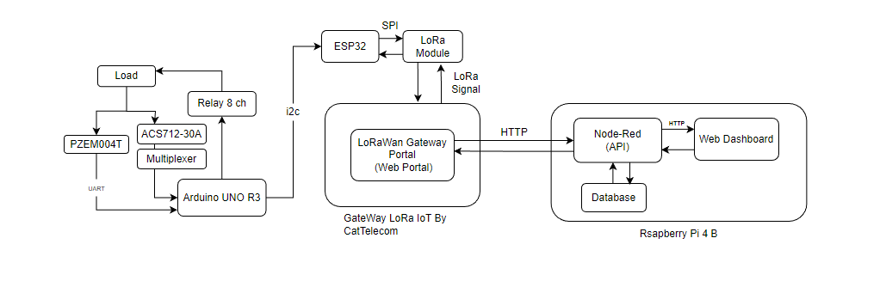

# Controlling-Electricity-Consumption-With-LoRaWan-Technology

    ภาพรวมของระบบควบคุมการใช้พลังงานไฟฟ้าโดยใช้เทคโนโลยี LoRaWan  มีการวัดค่าการใช้พลังงานอยู่สองส่วนคือวัดที่อุปกรณ์เครื่องใช้ไฟฟ้าหลอดไฟฟ้า 
    ด้วยเซนเซอร์ ACS712-30A หนึ่งตัวต่อหลอดไฟหนึ่งดวง เซนเซอร์ทุกตัวเชื่อมกับโมดูล Analog Multiplexer สำหรับขยายขา Analog และอ่านค่าจาก
    เซนเซอร์หลายตัวและส่วนที่สองวัดค่าการใช้พลังงานไฟฟ้ารวม โดยสามารถวัดค่ากระแสไฟฟ้า แรงดันไฟฟ้า พลังงานไฟฟ้า และค่าการใช้พลังงานไฟฟ้า
    ต่อหนึ่งชั่วโมง ด้วยโมดูลวัดค่าพลังงานไฟฟ้า Pzem004t ใช้ CT Current Sensor ครอบสายไฟฟ้าเส้นหลักขาออกจากเมนเซอร์กิตเบรกเกอร์
    เชื่อมต่อกับบอร์ด Arduino Uno R3 ผ่านโปรโทคอล UART จากนั้นส่งข้อมูลผ่าน I2C กับ ESP32 เพื่อนำข้อมูลที่รายละเอียดการใช้ไฟฟ้า ส่งข้อมูลผ่าน 
    LoRa Module ไปยังเกตเวย์สำหรับนำไปแสดงผลและควบคุมการทำงานผ่านเว็บแอปพลิเคชันแสดงผล
             

